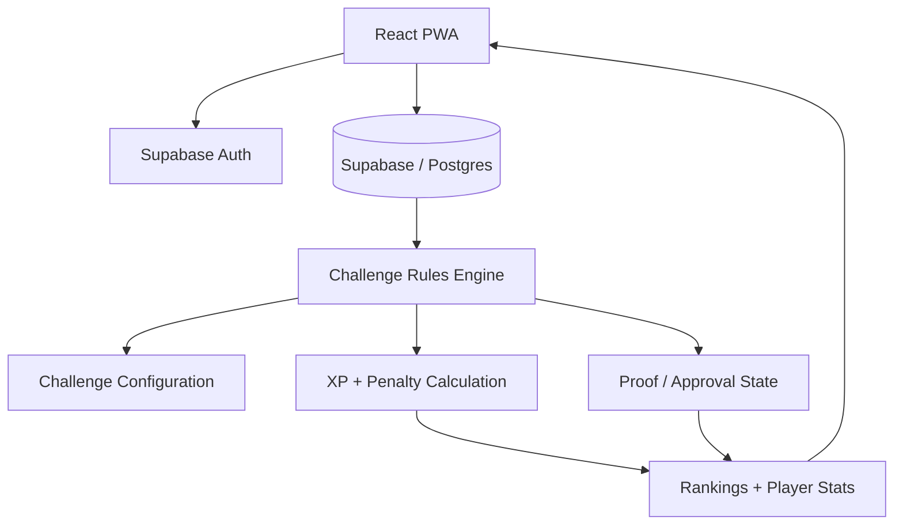

# Winter Arc 2026

> A configuration-driven challenge platform with backend-enforced rules, proof workflows, XP, rankings, and seasonal progression.

**Winter Arc 2026** is a React PWA backed by Supabase. Instead of hard-coding each challenge into the frontend, the system uses one shared rules engine that can support different commitment types, scoring rules, deadlines, proof requirements, and penalties.

The interesting part of the project is not the dashboard—it is the attempt to model a flexible challenge system without turning every new challenge into another custom code path.

## Core capabilities

- React 19 progressive web application
- TypeScript + Vite frontend
- Supabase-backed identity and application data
- Configuration-driven challenge definitions
- Daily and weekly commitments
- Repeatable seasonal attempts
- Amount, occurrence, and submission-based goals
- Cooldowns and deadlines
- Proof submission and approval
- Bonus caps and proportional penalties
- Backend-calculated XP
- Rankings plus Body / Mind / Soul / Craft progression
- Database migration and cutover workflow
- Automated frontend and backend verification

## Architecture



## Why a shared challenge engine?

A naive version of this product would encode every challenge separately:

```text
challenge A → custom logic
challenge B → more custom logic
challenge C → another special case
```

Winter Arc instead treats challenge behavior as data. The engine interprets configuration describing frequency, target type, proof rules, cooldowns, deadlines, rewards, and penalties.

That makes new challenges primarily a **configuration problem**, not a rewrite of the application.

## Stack

| Layer | Technologies |
|---|---|
| Frontend | React 19, TypeScript, Vite |
| Backend / Data | Supabase, PostgreSQL |
| Testing | Vitest, Testing Library |
| Tooling | Supabase CLI, TypeScript build checks |

## Development

Requires Node.js **22.13+**.

```bash
npm install
cp .env.example .env.local
npm run dev
```

## Verification

```bash
npm test -- --run --pool=forks --maxWorkers=1
npm run build
```

For the local backend:

```bash
npx supabase db start
node scripts/test-backend.mjs
npx supabase db advisors --local --type all --level warn --fail-on error
```

## Database operations

The repository includes an identity foundation migration and the shared challenge-engine migration. The initial challenge set is seeded through that engine.

Existing deployments should follow [`docs/operations/season-runbook.md`](docs/operations/season-runbook.md) rather than resetting the hosted database or blindly replaying migrations.

## Security note

Service-role credentials must remain server-side. Never expose service-role keys through `VITE_` environment variables or client bundles.

---

Built as an exercise in **product architecture, stateful backend rules, and turning repeated business logic into a reusable system**.